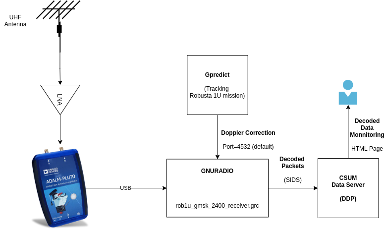
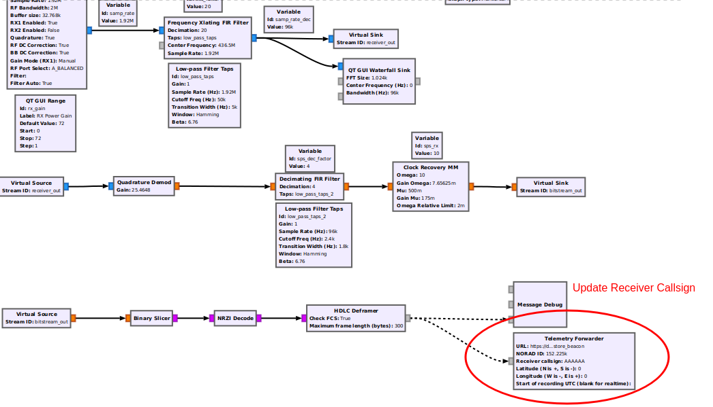
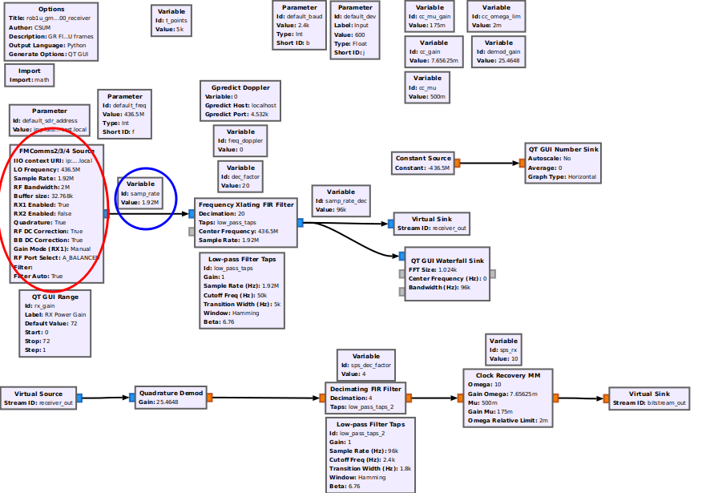

1U Decoder
==========

Reception
+++++++++

The diagram below shows the set of blocks required to receive signals from the 1U satellites. A `Pluto SDR <https://www.mouser.fr/new/analog-devices/adi-adalm-pluto>`_ is used to implement the digital to Radio-Frequency interface. The signal processing and packet decoding stages can be implemented using 
`GNURadio <https://www.gnuradio.org/>`_. Doppler correction on the receiving signal is performed by `Gpredict <http://gpredict.oz9aec.net/>`_.

.. tip:: In order to use the scripts **as it is** the Pluto SDR needs to be plugged to a USB port of a host computer and be configured with the default dns name: pluto.local.

The script **rob1u_gmsk_2400_receiver.grc** in the **receivers/** folder implements the filter and demodulation stages required to transform the incoming RF signals from the satellite into digital/raw binary data. The decoded packets will be printed in the terminal, but they will also be pushed to CSUM's server using the Simple Downlink Share Convention (SiDS) protocol. Once packets are pushed to CSUM's servers, they can be visualized on these two pages: `CELESTA <https://ddp.csum.umontpellier.fr/ROB1D/public>`_, `MTCUBE-2 <https://ddp.csum.umontpellier.fr/ROB1F/public>`_.

Setup
-----

Dependencies
************

Make sure to have all the following software modules before trying to launch the Gnuradio script

* `gr-gpredict-doppler <https://github.com/gruffen/gr-gpredict-doppler-3.8>`_
* `gr-satellites <https://github.com/daniestevez/gr-satellites>`_

Enabling Doppler Correction
***************************

* Adding a new TLE to Gpredict:
    You can add new TLE coordinates to GPREDICT by clicking on *Edit* -> *Update TLE from Local Files*. You can check this `reference <http://www.w1npp.org/events/2010/2010-f~1/SATELL~1/GPREDI~1.PDF>`_ for more information about Gpredict. 

* Activating the frequency tracker on Gpredict:
    
    * Add a new radio interface to Gpredict. Click on *Edit* -> *Preferences*. Then in the left panel, go to *Interfaces*, in tab *Radios* click on *Add new*. You should see the following screen:

        .. image:: _static/1u/add_radio_gpredict.png

    * Define a name for your interface (ie: *Radio CSUM*), set *Host: localhost* and *Port: 4532* as this will match the values in the Gnuradio Script. Click on OK to confirm.
    * On the right hand side of the main screen, click on the down arrow -> *Radio Control*. You should see the following screen: 

        .. image:: _static/1u/start_radio_gpredict.png

    * Under *Settings* -> *Device*, select the Radio interface you just created.
    * Under *Target*, select the satellite that you want to track (the one you just added the TLE)
    * Set the right downlink frequency for the satellite you want to track
    * Click on **Engage** then **Track**. The doppler correction should be updated in your Gnuradio script.

Packet Forwarder
****************

Packets decoded using the provided **rob1u_gmsk_2400_receiver.grc** script are automatically forwarded to CSUM's server. In order for the packets to be properly stored, make sure to update your HAMRADIO callsign in the *Telemetry Forwarder* block. The image below indicates which block to update in the GRC flowgraph.   

Using Another SDR
*****************

You can use another SDR device to decode signals from CSUM satellites. For that, you only need to replace the SDR Source block in the Gnuradio script, as shown below:

If you do so, make sure to update the sampling rate accordingly (blue circle).

Launching Procedure
-------------------

In order to start the reception flow, the following steps are required:

1. Open GnuRadio, set the right downlink frequency (Variable **default_freq**)
2. Open one of the receiver GRC scripts inside the **receivers** folder
3. Execute the flowgraph (Start button in gnuradio companion). You should see a simple waterfall display.
4. Open Gpredict, click on the down arrow on the right hand side of the main screen -> *Radio Control*. Select the proper radio interface and set the downlink frequency. Click on **Engage** then **Track**. 
5. Wait for the satellite to arrive

