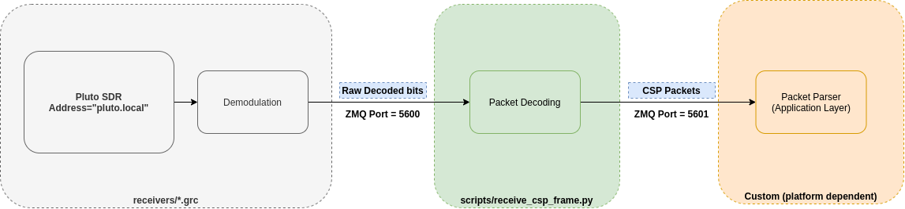
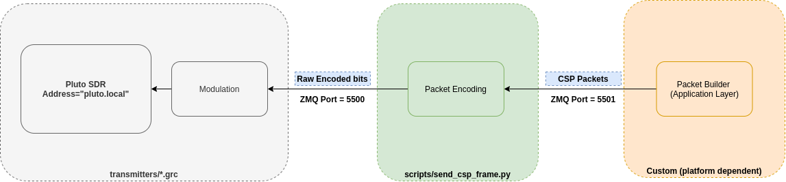

3U Decoder
==========

.. warning::

    This page is not maintained anymore, nor are the scripts. It is kept for additional information.

Reception
+++++++++

The diagram below shows the set of blocks required to receive signals from the satellite. A `Pluto SDR <https://www.mouser.fr/new/analog-devices/adi-adalm-pluto>`_ is used to implement the digital to Radio-Frequency interface. The set of scripts provided in the **receivers/** folder implement the filter and demodulation techniques required to transform the incoming RF signals from the satellite into digital/raw binary data. These decoded bits are then forwarded to another processing stage through a ZMQ Interface (**Port 5600**). The **receive_frame** python scripts inside the **scripts** folder can be then used to subscribe to this port and build the incoming CSP packets from this raw bit stream. The decoded packets will be printed in the terminal, but they will also be pushed to another ZMQ interface (**Port 5601**) so that the user can build its custom application (not provided in this repo), that will be in charge of further processing the incoming data.

.. tip:: In order to use the scripts **as it is** the Pluto SDR needs to be plugged to a USB port of a host computer and be configured with the default dns name: pluto.local.

In order to start the reception flow, the following steps are required:

1. Open GnuRadio
2. Open one of the receiver GRC scripts inside the **receivers** folder
3. Execute the flowgraph (Start button in gnuradio companion). You should see a simple waterfall display.
4. Open a terminal in the **scripts** folder.
5. Start the **receive_csp_frame.py** script: *python3 receive_csp_frame.py*

.. tip:: By default, the receiver gnuradio radio scripts are configured to receive signals at 437 MHz. Verify if that is the same transmission frequency of the satellite.

Transmission
++++++++++++

The transmission flow works in a similar way, but on the opposite direction. The packets can be built using a Custom script at the application layer (not provided in this repository). Then, these packets are pushed via ZMQ to **Port 5501**. The *send_csp_frame.py* script takes this packets, builds the proper radio packets and forward them to the ZMQ Interface (**Port 5500**) of the Gnuradio transmitter script, as shown in the picture below.

In order to start the reception flow, the following steps are required:

1. Open GnuRadio
2. Open one of the receiver GRC scripts inside the **transmitters** folder
3. Execute the flowgraph (Start button in gnuradio companion). You should see a simple waterfall display.
4. Open a terminal in the **scripts** folder.
5. Start the **send_csp_frame.py** script: *python3 send_csp_frame.py*

This script will keep listening to port ZMQ 5500 for new packets. Any data that is pushed to this port will be immediately encapsulated with a Radio Packet and dispatched to the gnuradio script and hence to the RF channel.

.. tip:: By default, the receiver gnuradio radio scripts are configured to receive signals at 435.8 MHz. Verify if that is the same transmission frequency of the satellite.
