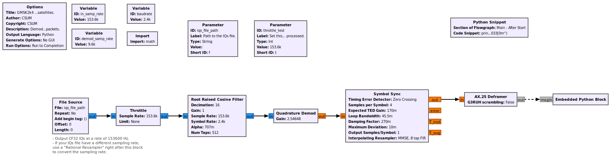

Demodulators
============

Currently there are 2 demodulators available: GMSK 2400 bps and GMSK 9600 bps.

This page explain how to use them.

Flowgraphs
**********

The provided demodulators are doing 2 things: they demodulates GMSK signals and decodes AX.25 packets. The demodulators do not perform Doppler corrections.
The signal fed to the demodulators must be corrected in Doppler.
Check the section `demodulators_complete_rx_flowgraph`_ for information on how to perform Doppler correction.

Each demodulator takes complex-float 32 (CF32) encoded IQs at their inputs and returns AX.25 packets at the standard output.
The sampling rate at the input is 153600 Hz.

Quick start
***********

To start the demodulator open a terminal, go to the demodulator folder and type:

.. code-block::

    ./csum_demod_gmsk2k4.py -f"/home/user/my_iqs_record.bin" -t30000000

**-f** specifies the path to the IQs record.
**-t** set the throttle of the flowgraph.

The **throttle** specifies "how quick" your computer will run the demodulator. If you want to run the demodulator in real-time, set the throttle to 153600 (aka the sampling rate).
If you want to demodulate rapidly, set the throttle very high like, in the example.

**csum_demod_gmsk9k6.py** is the demodulator for GMSK 9600 bps signals.

.. _demodulators_complete_rx_flowgraph:

Setup a complete reception chain
********************************

It is possible to setup a complete reception chain and use the demodulators.
This is done in two times, first, recording the IQs, then playing them in the demodulators.

This website: http://teslaintheether.blogspot.com/2018/02/setting-up-gqrx-and-gpredict-for.html explains how to setup **GQRX** and **GPredict** 
to listen to the satellites with the Doppler correction.

Once this setup is set, you need to save the IQs from **GQRX**. Do not forget that the demodulators work with a sampling rate of 153600 Hz.

To record the IQs, set the demodulation to **Raw I/Q** in the tab **Receiver Options** on the right panel and click **Rec** below.

Now you can play the IQs in the demodulator !

Changing the sampling rate at the input
***************************************

If your IQ record have a different sampling rate, you can insert the block **Rational Resampler** between the **File Source** and the **Throttle** to convert it.

Check https://wiki.gnuradio.org/index.php/Sample_Rate_Change for more information.

Demodulator flowgraphs
**********************

GMSK2400
~~~~~~~~

GMSK9600
~~~~~~~~

