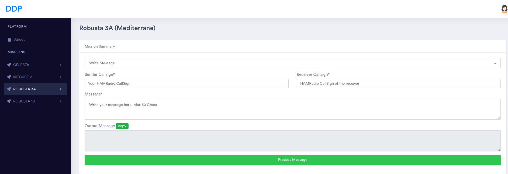
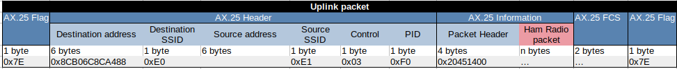
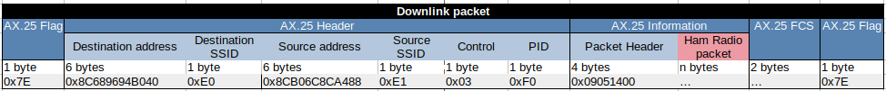

.. _firmware-tasks-hamradio-messaging-task:
.. sectnum::

HAM Radio Messaging System Task
===============================

.. contents:: Table of Contents
    :depth: 3

Overview
--------

The HAM radio messaging system provides a message-exchanging service between amateur radio users using Robusta satellite missions as relays. The main purpose of the system is to enable HAM radio operators to send and receive messages from anywhere in the world without having a direct (end-to-end) connection  between them.
The messaging system uses a method called ‘store and forward’ to provide this service. Messages are transported to the relay station (satellite) by a radio link, and from one geographical location to another, by the satellite orbital movement. An user sends a message to the satellite during a pass and the message is stored in the satellite's memory. The satellite then moves in its orbit, making the stored message available for other HAM radio operators. Users can request messages to the satellite which, in turn will check if there are any stored messages available for that particular operator. Finally, the message is transmitted and it arrives at its destination.

Robusta 3A TT&C
---------------

The ROBUSTA 3A satellite consists of different subsystems that are in charge of performing specific functions onboard the platform. In the context of the HAM radio messaging system, the TT&C (Telemetry, Tracking and Control) subsystem is the core component that enables the exchange of data between ground stations through an RF link. In addition, this link will enable the mission control center (MCC)/User to bidirectionally communicate with the satellite to receive data, and send commands to the satellite to perform actions.

- **HAM Radio Messaging System Task**: Implements the HAM radio messaging system. This task accepts HAM radio packets from the radio, sends HAM radio packets to the radio and performs different operations according to the received command.

Using The HAM Radio Messaging System
------------------------------------
Users who wish to exchange messages or communicate with the HAM radio messaging system will need to send a specific data set depending on the operation 
they want to execute. These data sets are called HAM radio packets.
User must create and configure they HAM radio packets as given in the section HAM radio packets using the data diffusion platform.
After the creation of the HAM radio packet users can use their own RF communication system to send them to the satellite. 

.. figure:: _static/images/ham_steps.svg
      :scale: 100 %
      :align: center
      :alt: HAM radio messaging system flow 

In the figure above we can see the steps to follow to communicate with the HAM radio messaging system.

In order to ensure the security of the communication the packets sent are pseudo-encrypted using a cipher algorithm so when users receive a HAM radio packet 
as the response of an 'ask message' command they must decrypt the encrypted part of this packet with the help of the data diffusion platform in order to read the message it contain.

More details about the encryption can be found in the HAM radio packet encryption section.

HAM Radio Packet
----------------

The HAM radio messaging system have two different command type and seven different command that can be used.
Command types are divided into user and administrator commands. The user type commands are the commands that can be used from radio amateur users,
the admin type commands are the private commands that can be used only from CSUM operators.
More information about command types and commands can be found in the tables below.

.. list-table:: Command types
   :align: center
   :header-rows: 1
   :widths: 60 80

   *  - Command Type
      - The byte that identifies the command type
   *  - User command
      - 'u'

.. list-table:: Command types and commands
   :align: center
   :header-rows: 1
   :widths: 10 10 60

   *  - Command Type
      - Command
      - The byte that identifies the command
   *  - User command
      - Send Message
      - 's'
   *  - User command
      - Ask Message
      - 'a'
   *  - User command
      - Get Saved Messages ID
      - 'c'

HAM radio packets have different configurations for different command and command type, and those configurations can be seen in the section below.

HAM Radio User Packets
**********************

.. figure:: _static/images/callsign.svg
      :scale: 120 %
      :align: center
      :alt: Call sign

Call signs are already used to identify a HAM Radio station or operator. Based on this the HAM Radio Messaging System also use call sign to identify users.
In the figure above we can see a call sign, it consist of two parts 'Prefix' and 'Serial letters'.

.. _SCMD:

* Send Message Command

.. figure:: _static/images/ham_sending_message.svg
      :scale: 120 %
      :align: center
      :alt: Send message command configuration

This HAM radio packet configuration shown above is used to send a message to another user.
The 'HAM CRC' is a value used to check if the message is changed since it was created,
it is automatically calculated from the encryption software.
The 'Command Type' must be 'u' because its a user command and 'Command' must be set to 's'.
The 'Sender Call Sign' is the call sign of the user who is sending the message,
the 'Recipient Call Sign' is the call sign of the user supposed to receive the message and the 'Message' part is the message to transmit.

When the user sends this packet and the satellite receives it, the HAM radio messaging system task will check the HAM CRC,command type, 
command, message length, how many messages has saved the sender of the package and the total number of stored messages, 
then it will store the message. These constraints have predefined values and can be viewed in the Constraints and Constants section.

* Ask Message Command

.. figure:: _static/images/ham_asking_message.svg
      :scale: 120 %
      :align: center
      :alt: Ask message command configuration

This HAM radio packet configuration shown above is used to ask the satellite if there is a saved message for the requesting user.
The 'Command Type' must be 'u' because its a user command and The 'Command' must be set to 'a'.
The 'Sender Call Sign' is the call sign for which the satellite will search a stored message.

When the user sends this packet and the satellite receives it, the HAM radio messaging system task will check the validity, create a packet containing the
message and send it if there is a message for the requested call sign (therefore the requesting user).

.. figure:: _static/images/ham_message_sat.svg
      :scale: 120 %
      :align: center
      :alt: Ask message command response packet configuration

This HAM radio packet configuration shown above is used when the message is sent to a user from the satellite.
It is basically what you will get when yo have sent the command 'ask message' to the satellite and the satellite found a message matching your call sign.
After the reception and validation of the HAM radio packet the HAM radio messaging system task will additionally add a 'Message Tag' and 'Timestamp'
to the packet before storing it. The 'Timestamp' is the number of seconds that have elapsed since January 1, 1970 (midnight UTC/GMT), its providing 
information about when the message was sent. The 'Message tag' is used for checking the state of stored message. More details about the 'Message Tag' 
can be found in the table below.

The encrypted part of the packet is encrypted from the HAM radio messaging system task before it was sent. So user must decrypt this part with the help 
of the data diffusion platform in order to read the message it contain.

.. list-table:: HAM radio Packet tag
   :align: center
   :header-rows: 1

   *  - Message Tag name
      - Description
      - Value
   *  - Sent
      - Tag of the message indicating that it was sent
      - 0x02
   *  - Not sent
      - Tag of the message indicating that it was not sent
      - 0x01
   *  - Erasable
      - Tag of the message indicating that it can be replaced by another message
      - 0x00

* Get Saved Messages ID Command

.. figure:: _static/images/ham_get_id.svg
      :scale: 120 %
      :align: center
      :alt: Get messages id command packet configuration

This HAM radio packet configuration shown above is used to get the timestamp, the sender and recipient call sign and the tag of all saved messages in satellite.
The 'Command Type' must be 'u' because its a user command and the 'Command' must be set to 'c'.

When the user send this packet and the satellite receives it, the HAM radio messaging system task will check the validity, check if there are saved messages,  
create a packet containing the identifiers of those saved messages and send it.

.. figure:: _static/images/ham_rep.svg
      :scale: 120 %
      :align: center
      :alt: Get messages id command response packet configuration

The HAM radio packet configuration shown above is what you will get when you have sent the command 'Get Saved Messages ID' to the satellite 
and if there is saved messages in the satellite.

HAM Radio ACK/NACK Packet
*************************

When data is transmitted between two systems, an acknowledgement (ACK) can be sent to confirm an action and a negative-acknowledgment (NACK) can 
be sent to report an error. Based on the situation the HAM radio messaging system task replies with a ACK/NACK packet to inform the GS/User.
For example if you send a HAM radio packet with 'Send Message' command and your packet is valid, the satellite will reply you with an ACK packet.
There are several different case which reply a ACK/NACK packet, those case can be seen in the functional diagram.

.. figure:: _static/images/ham_ack.svg
      :scale: 110 %
      :align: center
      :alt: ACK/NACK packet Data field configuration

The HAM radio messaging system task also uses the radio packet with 2 bytes in the 'data to send' field to create ACK/NACK packets. 
In the figure above we can see the ACK/NACK packet. The first field, 'Type Code', is used to identify the type of the packet. The second field, 
'ACK/NACK packet message code', is used to identify the message that give more details about the ACK/NACK.
The HAM radio messaging system task will create a ACK/NACK packet based on the situation and send it.
More information about ACK/NACK packets can be seen in the tables below.

.. table:: ACK/NACK packet type
   :widths: auto
   :align: center

   =====================  =========================
   ACK/NACK packet type   ACK/NACK packet type code
   =====================  =========================
    ACK                    0x01
    NACK                   0x02
   =====================  =========================

.. table:: ACK/NACK packet message
   :widths: auto
   :align: center

   ==== ============================ ====================================================================
   Type ACK/NACK packet message code ACK/NACK packet message
   ==== ============================ ====================================================================
   ACK     0x03                      Message is stored
   NACK    0x08                      Invalid command
   NACK    0x09                      Storable maximum message number has been reached
   NACK    0x0A                      Invalid HAM CRC
   NACK    0x0B                      No message for the given call sign
   NACK    0x0C                      Maximum length of the message exceeded
   NACK    0x0D                      Allowed maximum number of storable message for the person has been reached
   NACK    0x0E                      There are no saved messages at all
   NACK    0x0F                      The command type is invalid
   ==== ============================ ====================================================================

Valid characters
----------------

The valid characters in the Ham radio messaging system are shown below.

.. figure:: _static/images/ham_char.svg
      :name: char_table
      :width: 40%
      :align: center
      :alt: HAM radio messaging system valid characters

      HAM radio messaging system valid characters

Packet Encryption
-----------------

The HAM radio encryption is used in order to ensure that packets are sent from the correct user and delivered to the correct user. 
Beside that the encryption also provide a security for the admin type commands.
Before sending, the HAM radio packet is pseudo-encrypted with a cipher algorithm and a HAM CRC is automatically calculated and 
added to be sure that the content is not changed since the creation.

This encryption/decryption process is achieved with the help of the data diffusion platform.

.. _DDP:

DDP(Data Diffusion Platform)
----------------------------

The DDP is used to send data to CSUM external partners. This data can be mission data or other types of data that needs to shared. 
We have also developed a part for the ROBUSTA 3A mission and the HAM Radio messaging system. With this, 
users will be able to create their encrypted HAM radio packets to send them or decrypt their 
received HAM radio packets to read the message they contain. A general view of the DDP can be seen in the image below.

`Link to access the Data Diffusion Platform <https://ddp.csum.umontpellier.fr/>`_

      HAM radio messaging system Data diffusion platform

Radio packet
------------

AX.25 encapsulation
*******************

The HAM Radio packets are encapsulated into an AX.25 packet, when transmitted on the radio link. 
This is the format of the AX.25 packet used in uplink and in downlink:

      Encapsulation of HAM radio packet in AX.25 packet for uplink.

      Encapsulation of HAM radio packet in AX.25 packet for downlink.

Source and Destination Addresses
********************************

Addresses Format
~~~~~~~~~~~~~~~~

The source and destination addresses are derived from the radio amateur callsigns of the operator and the satellite.
Each characters of the callsign are binary shifted to the left. Here is an example.

Let's say the callsign is **AAAAAA**. The ASCII code equivalent of this callsign is **0x414141414141**.
It becomes **0x828282828282** when binary-shifted to the left. **0x828282828282** is therefore the address in the AX.25 packet.

Beware that the **ASCII blank space** is counted in the shift. It's shifted value is **0x40**

Uplink and Downlink Addresses values
~~~~~~~~~~~~~~~~~~~~~~~~~~~~~~~~~~~~

In uplink, the satellite only accepts packet where the destination address is set to **FX6FRD**. The source address can be any value.
In downlink, the satellite sets the source address to **FX6FRD** and the destination address to **'F4KJX '** (Mind the blank space character). 

Radio settings
--------------

Here are the radio settings to communicates with Robusta 3A:

* Uplink frequency: 435.75 MHz
* Downlink frequency: 436.75 MHz
* Modulation: GMSK
* Available datarates: 9600 bps (main datarate), 2400 bps or 38400 bps.
* Protocol: AX.25, scrambling disabled, FEC disabled.

A preamble is added in front of the packet. It's pattern before NRZ-I transform is **0x00**, after NRZ-I transform it is **0xAA** or **0x55**. 
It can be any size, 32 octets usually works right.

The TLe can be found on **SatNOGS**: https://db.satnogs.org/satellite/AEYC-6866-6455-5236-7157#data

